# ClimaHealth Systems
### From Climate Signals to Life-Saving Health Action
**A Climate-Health Early-Warning, Response and Public-Engagement Platform for Ghana**

*Submitted to the GreenRes Hackathon 2026 | Africa Climate Collaborative and the University of Ghana*

---

[](https://github.com/Joeboy77/ClimateHealth)
[](https://climate-health-seven.vercel.app/)
[](https://expo.dev/accounts/kkbaidu/projects/dawuro/builds/50bf6b45-6f8d-4a92-96c7-1cc6f049ca32)
[](https://climatehealth.onrender.com)
[](https://github.com/Joeboy77/ClimateHealth)

---

## 🚀 Live Deployments & Downloads

| Platform / Resource | Link | Description |
| :--- | :--- | :--- |
| 📱 **Dawuro Mobile App (APK)** | [Download Android APK](https://expo.dev/accounts/kkbaidu/projects/dawuro/builds/e4de8a9c-3b58-410a-baed-7b138f76556b) | Built Android production APK for the public mobile app |
| 🖥️ **Agency Command Platform** | [https://climate-health-seven.vercel.app/](https://climate-health-seven.vercel.app/) | Deployed Next.js web operations console for health agencies |
| ⚡ **Backend API & Prediction Engine** | [https://climatehealth.onrender.com](https://climatehealth.onrender.com) | FastAPI backend serving live climate predictions & WebSockets |
| 📚 **Interactive Swagger API Docs** | [https://climatehealth.onrender.com/docs](https://climatehealth.onrender.com/docs) | Live OpenAPI documentation & interactive endpoint testing |
| 📄 **Progress & Prototype Report** | [View Report PDF](ClimaHealth_Second_Submission_Progress_Report.pdf) | Complete 10-page hackathon progress submission document |

---

## 🌟 Executive Summary

Climate change is driving severe health risks across Ghana—from rain-fed **Malaria** and flood-driven **Cholera** to dry-season **Meningitis**, air-pollution **Respiratory illness**, and **Extreme Heat strain**. Too often, the healthcare system responds only after cases rise, and patients arrive at clinics too late.

**ClimaHealth Systems** inverts this model:
> *It does not begin with a disease and search for its causes. It begins with the live climate signal in a district and predicts every health consequence that signal implies, ranked by likelihood, onset window, and vulnerable group.*

The platform connects citizens and institutions into one cohesive defense system:
1. **Dawuro**: The public mobile application—named after the traditional Ghanaian town crier's gong-gong bell. It delivers a daily, personal health forecast in local Ghanaian languages (Twi, Ga, Ewe, Dagbani), turns residents into environmental reporters, educates them at the moment lessons become relevant, and rewards civic action with direct **National Health Insurance Scheme (NHIS)** registration & renewal.
2. **The Agency Command Platform**: The institutional web dashboard used by the Ghana Health Service (GHS), NADMO, EPA, GMet, Education Service, and District Assemblies, providing a shared view of risk, a coordinated multi-agency incident timeline, and clinic resource readiness monitoring.

---

## 📸 Key Prototype Screenshots

### 🖥️ Agency Command Platform (Web Dashboard)

#### 1. National Command Matrix & Interactive Map
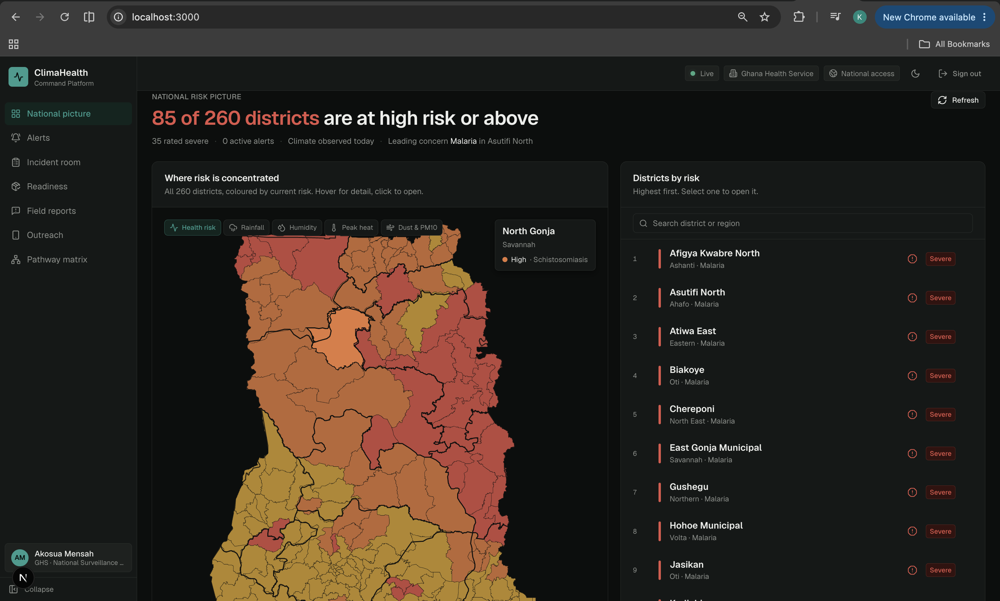
*Real-time risk map of Ghana displaying 85 of 260 districts at high risk or above, color-coded hazard filters (Rainfall, Humidity, Peak Heat, Dust & PM10), and ordered district triage queues.*

---

#### 2. District Deep-Dive & Explainable Risk Brief (Wa Municipal)
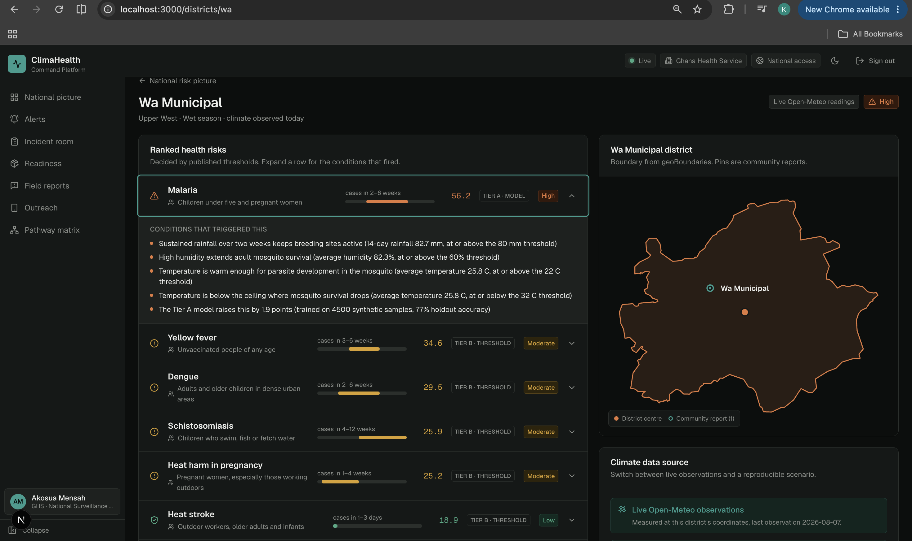
*District risk profile detailing ranked health conditions (Malaria 56.2, Yellow fever 34.6, Dengue 29.5), specific epidemiological triggers, lag windows, and confidence indicators (`TIER A · MODEL` vs `TIER B · THRESHOLD`).*

---

#### 3. Active Epidemiological Alerts Console
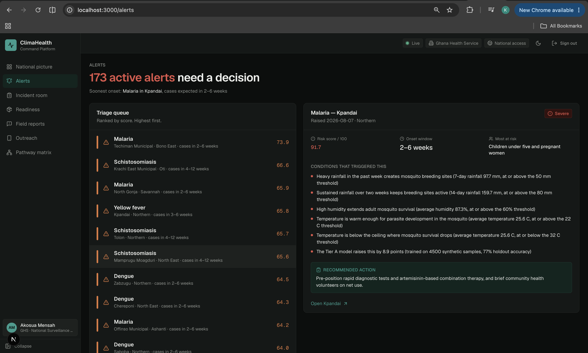
*Alert triage queue displaying active district alerts requiring executive action, evidence breakdown, and lead agency recommended interventions.*

---

#### 4. Shared Multi-Agency Incident Response Board
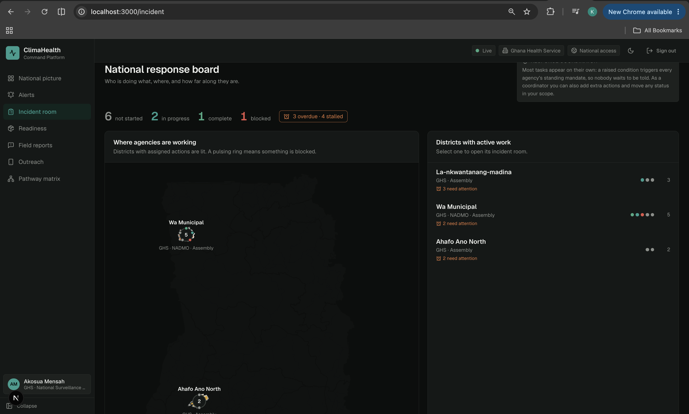
*Cross-agency response coordinator tracking assigned actions across GHS, NADMO, EPA, and Assemblies on a single timeline of accountability.*

---

#### 5. Multi-Channel Outreach & USSD Simulator
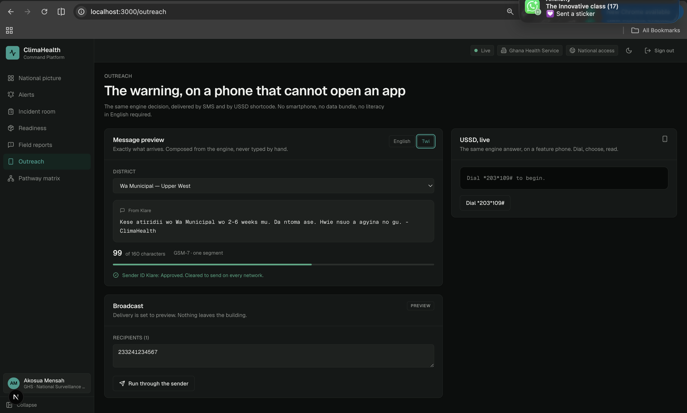
*Outreach console showing live Twi language SMS warning generation and interactive USSD feature-phone shortcode simulator (`*203*109#`).*

---

### 📱 Dawuro (Public Mobile Application)

| Splash Screen & Brand | Native Language Forecast (Twi) | Today's Action Cards |
| :---: | :---: | :---: |
| 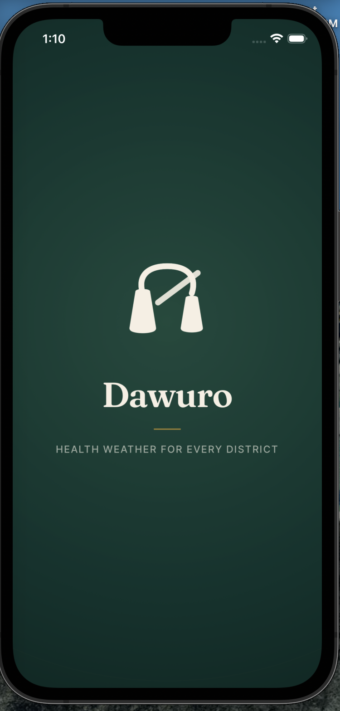 | 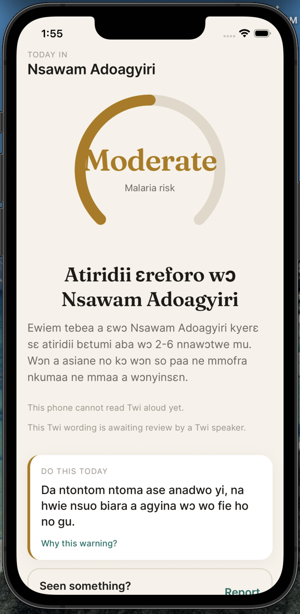 | 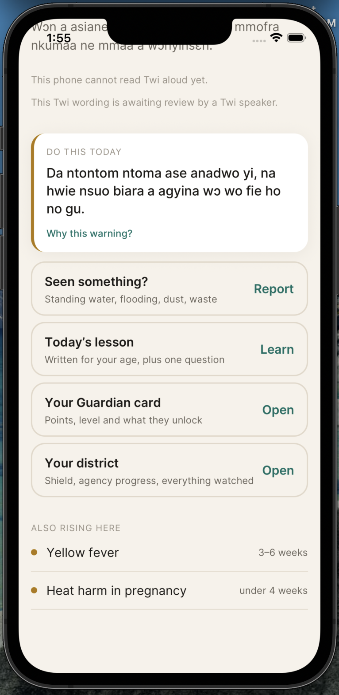 |
| *Gong-gong bell emblem & district health tagline* | *Twi forecast for Nsawam Adoagyiri ("Atiridii ɛreforo...")* | *Action of the day, report trigger & learning hub* |

| Weather Micro-Lesson | Climate Quiz Game | Quiz Reward & Level-Up |
| :---: | :---: | :---: |
| 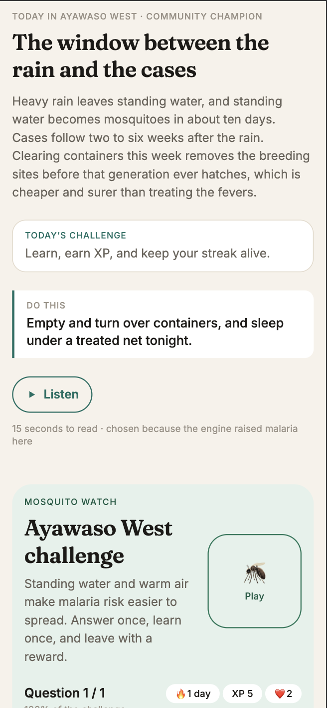 | 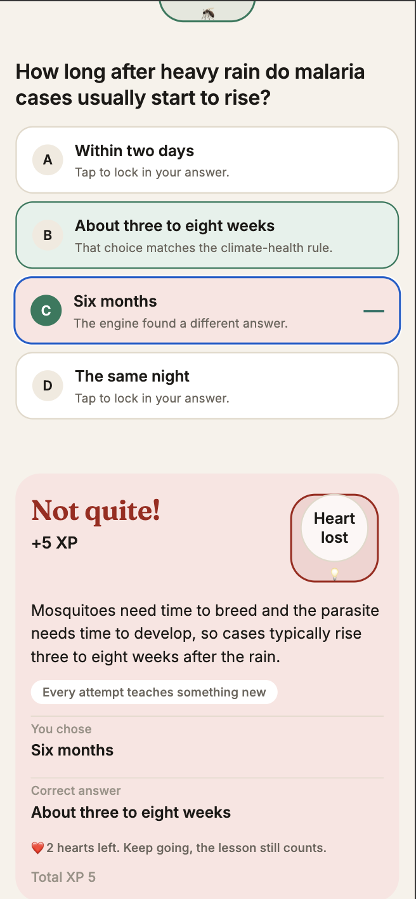 | 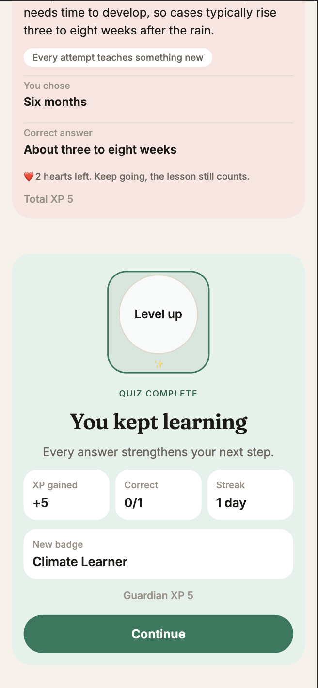 |
| *Just-in-time lesson with audio playback* | *Interactive quiz with instant epidemiological feedback* | *Level Up (+5 XP, Climate Learner badge)* |

---

## 💡 System Architecture: The Brain vs The Mouth

```
  [ Live Open-Meteo Weather/Air Quality Feeds ] + [ Geotagged Citizen Reports ]
                               │
                               ▼
        ┌──────────────────────────────────────────────┐
        │     THE BRAIN: Pure Epidemiological Engine   │
        │  • Deterministic rule evaluation             │
        │  • Published health thresholds & lags        │
        │  • District Context Weighting                │
        │  • 100% reproducible, explainable scores     │
        └──────────────────────┬───────────────────────┘
                               │
                               ▼
              [ Ranked, Explainable Health Brief ]
                               │
         ┌─────────────────────┴─────────────────────┐
         ▼                                           ▼
┌───────────────────────────────────┐     ┌───────────────────────────────────┐
│     Agency Command Platform       │     │    THE MOUTH: Communication AI    │
│  (Raw metrics, clinical demand,   │     │  • Citizen-friendly summaries     │
│   supply stock & incident queues) │     │  • GhanaNLP Khaya Translator      │
└───────────────────────────────────┘     │  • Twi, Ga, Ewe, Dagbani speech   │
                                          └─────────────────┬─────────────────┘
                                                            │
                                                            ▼
                                          ┌───────────────────────────────────┐
                                          │      Dawuro Mobile Application    │
                                          │  (Daily forecast & actionable advice)│
                                          └───────────────────────────────────┘
```

- **The Brain is pure domain logic**: Located in `backend/climahealth/domain/`, it evaluates 5 Tier 1 disease pathways using Pydantic domain models. It has zero external dependencies, zero I/O, and zero probabilistic LLM randomness.
- **The Mouth is an isolated communication layer**: Located in `backend/climahealth/infrastructure/narrator/`, it takes the engine's structured decisions and phrases them into accessible wording and Ghanaian languages (**Twi**, **Ga**, **Ewe**, **Dagbani**) via the **GhanaNLP Khaya API**.

---

## 🔐 Scope-Based Access Control (RBAC) & Demo Accounts

The platform enforces strict role-based data boundaries:

| Username | Password | Role Scope | Permitted Access |
| :--- | :--- | :--- | :--- |
| `national.officer` | `national-demo-2026` | National Administrator | Unrestricted access to all 260 Ghanaian districts |
| `madina.officer` | `madina-demo-2026` | District Health Officer | Restricted to La-Nkwantanang-Madina District |

### 🛠️ Deterministic Demo Override Controls
Judges and evaluators can trigger live scenario overrides on demand without waiting for real-world weather:

```bash
# Authenticate as National Officer
TOKEN=$(curl -s -X POST https://climatehealth.onrender.com/login \
  -H 'Content-Type: application/json' \
  -d '{"username":"national.officer","password":"national-demo-2026"}' \
  | python3 -c 'import sys,json; print(json.load(sys.stdin)["access_token"])')

# Simulate Heavy Rain in Madina (Triggers Severe Malaria Risk)
curl -s -X POST https://climatehealth.onrender.com/demo/set-conditions \
  -H "Authorization: Bearer $TOKEN" \
  -H 'Content-Type: application/json' \
  -d '{"district_id":"madina","scenario":"heavy_rain"}'

# Query Updated Forecast
curl -s https://climatehealth.onrender.com/forecast/madina -H "Authorization: Bearer $TOKEN"

# Clear Demo Override (Returns to Live Open-Meteo Data)
curl -s -X DELETE https://climatehealth.onrender.com/demo/set-conditions/madina -H "Authorization: Bearer $TOKEN"
```

---

## 🛠️ Tech Stack & Codebase Structure

```
ClimateHealth/
├── backend/                  # Python 3.13 FastAPI Backend & Engine
│   ├── climahealth/
│   │   ├── domain/           # Pure Epidemiological Rules Engine (No I/O)
│   │   ├── services/         # Use cases, Scope Guard (RBAC), Ports
│   │   ├── infrastructure/   # Open-Meteo, GhanaNLP, WebSockets, DB
│   │   └── api/              # FastAPI Routers, OpenAPI Schemas, WS
│   └── tests/                # 449 Passing Unit, Integration & Purity Tests
├── web/                      # Agency Command Platform (Next.js 15 + TypeScript)
│   └── src/app/              # Command Matrix, Incident Room, Readiness, Alerts
├── mobile/                   # Dawuro App (React Native + Expo + TypeScript)
│   └── app/                  # Daily Forecast, Community Watch, Guardians Hub
└── docs/screenshots/        # High-resolution prototype screenshot assets
```

### Core Technologies
- **Backend**: Python 3.13, FastAPI, Pydantic v2, Open-Meteo API, GhanaNLP Khaya Translation API, WebSockets, Pytest.
- **Web App**: Next.js 15 (App Router), React 19, TypeScript, Tailwind CSS, Lucide Icons.
- **Mobile App**: React Native, Expo, TypeScript, Fraunces Serif & Inter Typography.
- **Deployment**: Vercel (Web Frontend), Render (FastAPI Backend), Expo Application Services (Android APK).

---

## 🧪 Technical Verification & Test Suite

The engine is protected by **449 automated unit, integration, and architectural tests**:

```bash
cd backend
uv run pytest
```
- **100% Offline Test Isolation**: An autouse fixture blocks all network sockets suite-wide.
- **Domain Purity Enforcement**: AST static analysis enforces that `climahealth.domain` imports zero external frameworks.
- **Contract & RBAC Security**: Automated contract tests verify `401 Unauthorized` and `403 Forbidden` cross-district access blocks.

---

## 💻 Local Installation & Setup Guide

### 1. Backend Setup
```bash
cd backend
uv sync
uv run uvicorn climahealth.api.main:app --reload
```
Interactive Swagger docs run at `http://127.0.0.1:8000/docs`.

### 2. Web App Setup
```bash
cd web
npm install
npm run dev
```
Access the command console at `http://localhost:3000`.

### 3. Mobile App Setup
```bash
cd mobile
npm install
npx expo start
```
Scan the QR code with Expo Go or run on Android/iOS emulator.

---

## 📜 License & Acknowledgments

- **Hackathon**: Submitted to the **GreenRes Hackathon 2026** organized by the Africa Climate Collaborative and the University of Ghana.
- **Open Data**: Powered by Open-Meteo weather feeds, WorldPop, and GhanaNLP Khaya API.
